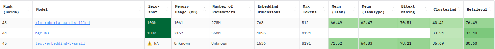

## xlm-roberta-ua-distilled 🇺🇦🇬🇧

Check out the model card on [HF](https://huggingface.co/panalexeu/xlm-roberta-ua-distilled) 📄

Also, try the model in action directly via the interactive demo on [HF Spaces](https://huggingface.co/spaces/panalexeu/xlm-roberta-ua-distilled) 🧪 No setup required — test its capabilities right in your browser! 💻


### MTEB 

As of April 17, 2025, the model achieves a rank of 43 on the [MTEB leaderboard](https://huggingface.co/spaces/mteb/leaderboard) for the Ukrainian language and ranks higher than [text-embedding-3-small](https://openai.com/index/new-embedding-models-and-api-updates/) by OpenAI, which is ranked 45th.



### Benchmarks

Below is the performance of the models measured on [sts17-crosslingual-sts](https://huggingface.co/datasets/mteb/sts17-crosslingual-sts), using Spearman correlation between the predicted similarity scores and the gold scores.

| model                                | en-en    | en-ua    | ua-ua    | 
| ------------------------------------ | -------- | -------- | -------- |
| multi-qa-mpnet-base-dot-v1           | **75.8** | 12.9     | 62.3     |
| XLM-RoBERTa                          | 52.2     | 13.5     | 41.5     |
| xlm-roberta-ua-distilled*            | 73.1     | **62.0** | **64.5** |

For evaluation and benchmarking, the [sts17-crosslingual-sts](https://huggingface.co/datasets/mteb/sts17-crosslingual-sts) (semantic textual similarity) dataset was used. It consists of multilingual sentence pairs and a similarity score from 0 to 5 annotated by humans. However, the `sts17-crosslingual-sts` dataset does not provide sentence pairs for the Ukrainian language, so they were machine-translated using `gpt-4o`, resulting in `en-en`, `en-ua`, and `ua-ua` evaluation subsets. You can check out the translation process in more detail in the following [notebook](./researches/dataset_translation.ipynb). 

To see the benchmarking process in more detail, check out the following [notebook](./researches/benchmarks.ipynb).

### Training Approach

To train the model, the approach proposed by Nils Reimers and Iryna Gurevych in the following [research paper](https://arxiv.org/pdf/2004.09813) was used.

The idea of the approach is to distill knowledge from the teacher model to the student model, with the loss function being Mean Squared Error (MSE). 

The MSE is calculated between the teacher model’s embedding of a sentence (e.g., in English) and the student model’s embedding of the same sentence in English, as well as versions of the same sentence in other languages (in our case, Ukrainian only).


In this way, the proposed approach not only distills knowledge from the teacher model to the student, but also "squeezes" the embeddings of different training languages together - which makes sense, since semantically equivalent sentences should have similar vector representations across languages.

This results in improved model performance across several training languages and better cross-lingual transfer.

[SentenceTransformers](https://sbert.net/) library provides ready-to-use tools to implement the training process described above.

The teacher model chosen was [multi-qa-mpnet-base-dot-v1](https://huggingface.co/sentence-transformers/multi-qa-mpnet-base-dot-v1). This model is monolingual (English) and achieves great performance on semantic search tasks (which is well-suited for RAG), based on the benchmarks provided [here](https://sbert.net/docs/sentence_transformer/pretrained_models.html).

The student model chosen was [XLM-RoBERTa](https://huggingface.co/FacebookAI/xlm-roberta-base). This model is a multilingual version of RoBERTa, trained on CommonCrawl data covering 100 languages.

The training was performed on the following parallel sentence datasets, specifically on the `en-uk` subsets:

* [parallel-sentences-talks](https://huggingface.co/datasets/sentence-transformers/parallel-sentences-talks);
* [parallel-sentences-wikimatrix](https://huggingface.co/datasets/sentence-transformers/parallel-sentences-wikimatrix);
* [parallel-sentences-tatoeba](https://huggingface.co/datasets/sentence-transformers/parallel-sentences-tatoeba);

The combined training dataset resulted in more than 500,000 sentence pairs. 

The training was performed for 4 epochs with a batch size of 48. The training hardware was a GPU P100 with 16 GB of memory provided by [Kaggle](https://www.kaggle.com/). On the GPU P100, training took more than 8 hours.

You can check out the training process in more detail in the following [notebook](./researches/research_final.ipynb). 

### Usage Example 

```python
from sentence_transformers import SentenceTransformer

model = SentenceTransformer('panalexeu/xlm-roberta-ua-distilled')

sentences = [
    'I love coffee!',
    'Я люблю каву!',
    'C is a compiled programming language known for its speed and low-level memory access.',  
    'Python — це інтерпретована мова програмування, що цінується за простоту та читабельність.'
]

embeds = model.encode(sentences)
embeds.shape
#( 4, 768)

model.similarity(embeds, embeds)
# tensor([[1.0000, 0.9907, 0.3557, 0.3706],
#        [0.9907, 1.0000, 0.3653, 0.3757],
#        [0.3557, 0.3653, 1.0000, 0.7821],
#        [0.3706, 0.3757, 0.7821, 1.0000]])
```

A usage example is also provided as a [notebook](./researches/usage_example.ipynb).
